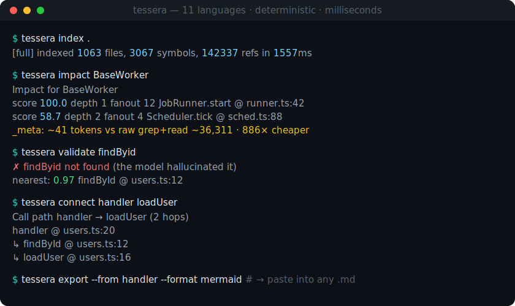

<p align="center">
  
</p>

<p align="center">
  <b>A local, <i>deterministic</i> semantic code graph for AI coding agents.</b><br>
  Stop burning tokens on <code>grep</code> + file reads. Answer “where is this?”, “who calls it?”,
  “how does A reach B?”, and “did the model hallucinate this symbol?” — deterministically, over a
  Tree-sitter graph indexed in seconds and queried in milliseconds.
</p>

<p align="center">
  <a href="https://crates.io/crates/tessera-codegraph"></a>
  <a href="https://www.npmjs.com/package/tessera-codegraph"></a>
  <a href="https://crates.io/crates/tessera-codegraph"></a>
  <a href="https://github.com/iamsaquib8/tessera/actions/workflows/ci.yml"></a>
  <a href="LICENSE"></a>
  <a href="https://github.com/sponsors/iamsaquib8"></a>
</p>

<p align="center">
  
</p>

⭐ **Star this repo** if it saves your agent from a grep spiral — it helps others find it.
💚 **[Sponsor on GitHub](https://github.com/sponsors/iamsaquib8)** if Tessera saves you tokens at work.

> **11 languages · deterministic, AST-exact graph · CLI · MCP server · Rust library.** Not LLM-extracted — same input, same graph, zero tokens to build it.

---

## Measured on real production repos

`tessera bench --path .` runs against any repo and prints the chart below. The harness ships in the binary — every number here is reproducible.

### 951-file Java Service

```
Tessera v0.3.1 bench
─────────────────────
  951 files · 16,368 symbols · 129,959 references

Index time
  full         ████████████████████████████████    2,981 ms
  incremental  █                                      40 ms   ·  75× faster

"who calls parseFrom?"
  raw grep + read   ████████████████████████████████   394,140 tokens
  tessera           █                                    6,530 tokens   ·  60× cheaper

Per-query latency  ·  median of 3 runs
  find_definition      1 ms     ~ 1,781 tokens
  find_references      8 ms     ~16,144 tokens
  impact             371 ms     ~ 6,530 tokens
  validate             1 ms     ~    48 tokens
```

### 1,063-file Node.js service

```
Tessera v0.3.1 bench
─────────────────────
  1,063 files · 3,067 symbols · 142,337 references

Index time
  full         ████████████████████████████████    1,557 ms
  incremental  █                                      38 ms   ·  41× faster

"who calls BaseWorker?"
  raw grep + read   ████████████████████████████████    36,311 tokens
  tessera           █                                       41 tokens   ·  886× cheaper

"where is BaseWorker defined?"
  raw grep + read   ████████████████████████████████     1,790 tokens
  tessera           ██                                      90 tokens   ·  20× cheaper

Per-query latency  ·  median of 3 runs
  find_definition      0 ms     ~    90 tokens
  find_references      8 ms     ~    33 tokens
  impact               1 ms     ~    41 tokens
  validate             0 ms     ~    49 tokens
```

### Headlines

- **60–900× fewer tokens** to answer "who calls this?" — the work your agent spends most of its context window on.
- **38–40 ms incremental re-index** on near-million-LOC repos — fast enough to run on every file save.
- **Sub-20 ms** for definition / reference / validation queries.
- **CommonJS-aware**: `require('./foo')` is indexed alongside ES6 `import`, so `imports` / `imported_by` work on legacy Node code too.

## Install

No Rust toolchain required — pick whatever fits your stack:

```sh
npm install -g tessera-codegraph                 # Node / any JS-agent setup (npx tessera-codegraph also works)
brew install iamsaquib8/tessera/tessera          # macOS / Linux (Homebrew)
curl -fsSL https://raw.githubusercontent.com/iamsaquib8/tessera/main/install.sh | sh   # prebuilt binary
cargo install tessera-codegraph                  # from source
docker run --rm -v "$PWD:/work" ghcr.io/iamsaquib8/tessera index /work   # container
```

Prebuilt binaries for macOS (arm64/x64), Linux (x64/arm64), and Windows are attached to every [release](https://github.com/iamsaquib8/tessera/releases).

### Zero-install: drop-in agent skill

Prefer not to install anything? Copy the [`/tessera` Agent Skill](skills/) into `~/.claude/skills/` and Claude Code (or any skill-aware agent) will use Tessera for navigation automatically — installing the binary on first use:

```sh
cp -r skills/tessera ~/.claude/skills/tessera
```

## Daily-use commands

```sh
tessera init --mcp-configs               # generate project-local defaults and MCP snippets
tessera index .                          # index your repo into .tessera/tessera.db
tessera watch .                          # keep the graph fresh while you edit
tessera doctor                           # check DB, schema, snapshot, parsers, and MCP command
tessera impact findById                  # transitive callers ranked by personalised PageRank
tessera validate findByIdd               # "did the model hallucinate this?" — yes; meant findById (0.98)
tessera connect handleRequest writeRow   # the shortest call path from A to B
tessera export --from findById --format mermaid   # the call subgraph, as a diagram you can paste anywhere
tessera export --from findById --group-by language --html-out graph.html
tessera context-pack findById            # body + deps + callers + tests in one budgeted bundle
tessera plan-query "edit findById safely" --symbol findById
tessera edit-prep findById
tessera unused --kind function           # symbols with no inbound refs/call edges
tessera completions zsh                  # shell completions for bash/zsh/fish/PowerShell
tessera mcp-http --addr 127.0.0.1:8765   # HTTP/SSE MCP transport with /health
```

That's it. The graph is local, the queries are deterministic, every response carries `_meta` token estimates so agents can plan their context budget.

## Why a *deterministic* graph?

A wave of tools build a code "knowledge graph" with an **LLM extraction** pass. That's great for breadth and prose ("what is this and *why* was it designed this way") — but it's a strange foundation for the one job that matters most to an agent: **not getting lied to.** An LLM-extracted graph is non-deterministic, costs tokens *every time you build it*, and can hallucinate edges of its own.

Tessera goes the other way. The graph is **pure Tree-sitter AST + static resolution** — same input, same graph, every run, **zero LLM tokens to build**. "Who calls `parseFrom`?" is a fact from the parser, not an inference. And because the graph is ground truth, Tessera can do the inverse of hallucinating: it **catches** the model's hallucinations (`validate`), deterministically. It's also a real **engine** — CLI, library, and MCP server you can run in CI or a pipeline — not a prompt package that only lives inside an agent session.

> **graphify-style tools** = *understand my whole project, explained by an LLM* (broad, multimodal, interpretive).
> **Tessera** = *navigate my code with compiler-grade precision, verified against ground truth, with a hallucination guard* (exact, deep, trustworthy).
>
> Different jobs. If you want the second one, this is the tool.

## How it compares

| | Tessera | LLM-extracted graph (graphify-style) | `aider`'s repomap | Sourcegraph | Cursor's index |
| --- | --- | --- | --- | --- | --- |
| How the graph is built | **Tree-sitter AST (deterministic)** | LLM semantic extraction | static repomap | indexers | proprietary |
| Tokens to build / maintain the graph | **0** | LLM pass every build | low | n/a | n/a |
| Same input → same graph | ✅ | ❌ (non-deterministic) | ✅ | ✅ | — |
| Catches *model* hallucinations | ✅ `validate` | ❌ (can introduce them) | ❌ | ❌ | ❌ |
| Personalised PageRank impact | ✅ | ❌ | ✅ (non-personalised) | ❌ | ❌ |
| Call-path tracing (`connect`) + graph export | ✅ | ❌ | ❌ | partial | ❌ |
| Runnable as CLI / library / CI (not just in-agent) | ✅ | ❌ (prompt package) | partial | ✅ | ❌ |
| Local-only, no cloud | ✅ | ✅ | ✅ | ❌ (enterprise) | ❌ |
| MCP server | ✅ | varies | ❌ | ❌ | ❌ |
| Incremental re-index in ms | ✅ | ❌ | partial | ❌ | proprietary |
| Open source (Apache-2.0) | ✅ | varies | ✅ | core | ❌ |

## What makes it different

- **Personalised PageRank impact.** Not just "who calls X" — *who calls X **that matters***. The random surfer teleports back to your edit site, so transitively reachable hubs float to the top with auditable breakdowns (`pagerank`, `fanout_in`, `fanout_out`, `exported`, `test_coverage`, `depth_decay`).

- **Hallucination validator.** Bloom-filter-fronted symbol existence check + a snippet validator that parses LLM output with the same Tree-sitter pipeline that built the graph. Every call is verified; near-misses come back with Jaro-Winkler confidence scores.

  ```sh
  echo 'findByIdd(1)' | tessera validate-snippet --language typescript
  ```
  ```
  ✗ findByIdd at line 1 col 1
        -> maybe findById (0.98)
        -> maybe find_by_id (0.85)
  ```

- **Incremental everywhere.** Re-running `tessera index .` only re-parses files whose SHA changed. 951-file Java repo: full index 4.6 s, incremental rerun **64 ms**.

- **Memory-mapped graph snapshot.** MCP server `mmap`s a `bincode` archive of the symbol + edge tables at startup. Hot-path queries don't touch SQLite.

- **React-aware.** `.tsx` parsed with the TSX grammar. `<UserCard />` registers a reference to `UserCard` of kind `jsx`, so React component graphs work the same as call graphs.

- **Call-path tracing.** `tessera connect handleRequest writeRow` returns the shortest chain of calls from one symbol to another — "does A actually reach B, and how?" — a deterministic graph traversal an LLM-extracted graph can't answer reliably.

- **Shareable graph export.** `tessera export --format mermaid` (or `dot`) renders the call graph — the whole thing, or the precise forward subgraph rooted at a symbol with `--from`. Group by file, directory, or language; hide test nodes; filter to exported endpoints; or write a copy-button Mermaid preview with `--html-out graph.html`.

- **Token-priced operations.** Every response carries `_meta` with token estimates plus cheaper alternative queries. Agents can route to the right fidelity-to-token tradeoff.

## A 30-second demo

```sh
tessera index examples/sample
tessera impact findById --json | jq '.callers[0] | {symbol: .symbol.qualified_name, criticality, breakdown}'
```
```json
{
  "symbol": "renderUser",
  "criticality": 100.0,
  "breakdown": {
    "pagerank": 0.4674,
    "fanout_in": 0,
    "fanout_out": 1,
    "exported": true,
    "test_coverage": 0,
    "depth_decay": 1.0
  }
}
```

## Wire it up to your coding agent

Tessera speaks **MCP**. Index your repo, point your agent at the binary.

**Claude Code:**

```sh
claude mcp add tessera tessera -- mcp --db .tessera/tessera.db
```

**Cursor** — add to `~/.cursor/mcp.json` (global) or `.cursor/mcp.json` (per-project):

```json
{
  "mcpServers": {
    "tessera": {
      "command": "tessera",
      "args": ["mcp", "--db", "${workspaceFolder}/.tessera/tessera.db"]
    }
  }
}
```

Configs for **Cline, Continue.dev, Codex CLI, Zed, Aider, and custom GPTs** live in [docs/integrations.md](docs/integrations.md). Tool schemas in [docs/mcp.md](docs/mcp.md).

**Exposed tools:** `find_definition` · `find_references` · `get_outline` · `expand_symbol` · `impact` · `connect` · `export` · `context_pack` · `plan_query` · `edit_prep` · `diff_impact` · `imports` · `imported_by` · `signature` · `siblings` · `search` · `unused` · `validate` · `validate_snippet` · `tests_for` · `stats`.

**Tip:** run `tessera doctor` when a query looks stale or an MCP client cannot connect. It prints the exact `tessera index . --db ...` or `tessera snapshot --db ...` command to repair the local setup.

Start with the [first five minutes guide](docs/first-five-minutes.md), and read
[when not to use Tessera](docs/when-not-to-use.md) for the current precision
limits. Troubleshooting lives in [docs/troubleshooting.md](docs/troubleshooting.md).

## Use as a Rust library

```toml
[dependencies]
tessera-codegraph = "0.4"
```

```rust
use tessera_codegraph::{Index, IndexOptions, Language};

let report = Index::build("./repo", "./repo/.tessera/tessera.db", IndexOptions::default())?;
let idx = Index::open("./repo/.tessera/tessera.db")?;

for caller in idx.impact("findById", 4)?.callers.iter().take(5) {
    println!("{:5.1}  {}", caller.criticality, caller.symbol.qualified_name);
}

let check = idx.validate_snippet("findByIdd(1)", Language::TypeScript)?;
println!("{} unresolved calls", check.unresolved_calls);
```

## Languages

**11 languages**, each with real AST-level extraction (definitions, references, imports) — not a regex guess:

| Language | Extensions | Notes |
| --- | --- | --- |
| TypeScript | `.ts`, `.mts`, `.cts` | Parsed with the TSX grammar (a superset of TS) |
| TSX (React) | `.tsx` | `<Component />` and `<Foo.Bar />` register as references of kind `jsx` |
| JavaScript | `.js`, `.jsx`, `.mjs`, `.cjs` | JSX-aware; CommonJS `require` + ES6 `import` |
| Java | `.java` | Classes, interfaces, records, enums, methods, constructors, invocations, `new` |
| Python | `.py`, `.pyw` | Functions, classes |
| Go | `.go` | Functions, methods (receiver-qualified), structs, interfaces |
| Rust | `.rs` | Functions, methods, structs, enums, traits, modules, macro invocations |
| C | `.c` | Functions, structs, enums, unions, `#include` |
| C++ | `.cpp`, `.cc`, `.cxx`, `.h`, `.hpp`, … | Classes, namespaces, methods, `new`; `.h` parsed as C++ (a C superset) |
| C# | `.cs` | Classes, interfaces, structs, records, enums, methods, `using`, `new` |
| Ruby | `.rb` | Classes, modules, methods, `require` |
| PHP | `.php`, `.phtml` | Classes, interfaces, traits, enums, functions, methods, `use` |

More on the way (Kotlin, Swift, Scala, Lua, Zig — see [ROADMAP.md](ROADMAP.md)). Skips `.git`, `node_modules`, `target`, `dist`, `.next`, `.venv`, `__pycache__`, and other common noise.

## Reproduce the bench

```sh
tessera bench --path /path/to/your/repo
tessera bench --scale 200                # synthetic 200-file TS repo, no arguments
tessera bench --out docs/benchmarks.md   # write the chart to disk
```

The synthetic repo (`tessera bench` with no `--path`) models a "popular utility" topology: a `sharedHelper` called from every module file, mirroring how high-impact refactors really cascade through a codebase. See [docs/benchmarks.md](docs/benchmarks.md) for methodology.

## Architecture

Rust core · Tree-sitter (12 grammars, 11 languages) · SQLite (WAL, FTS5 trigram, Bloom) · memory-mapped snapshot · personalised PageRank impact · MCP stdio.

```text
source files
  ─► tree-sitter parsers (ts/tsx/js, java, py, go, rust, c, c++, c#, ruby, php)
  ─► symbols, references, edges, exports
  ─► SQLite (WAL, FTS5 trigram, bloom blob)
  ─► memory-mapped snapshot (.tessera/snapshot.bin)
  ─► CLI · MCP server · library API
```

Details: [docs/architecture.md](docs/architecture.md) · Quickstart: [docs/quickstart.md](docs/quickstart.md) · Benchmarks: [docs/benchmarks.md](docs/benchmarks.md)

## Development

```sh
cargo fmt --check
cargo clippy --all-targets --all-features -- -D warnings
cargo test --all-targets --all-features
```

## Status

**v0.9 — pre-alpha.** 11 languages, JSX-aware React references, incremental indexing, PageRank-ranked impact, hallucination validator, agent workflow planning, call-path tracing (`connect`), shareable graph export (DOT/Mermaid/HTML preview), HTTP/SSE MCP transport with health metadata, and install via npm / Homebrew / curl / Docker / cargo — library + MCP + CLI. See [CHANGELOG.md](CHANGELOG.md) and [ROADMAP.md](ROADMAP.md).

## Contributing

PRs welcome — parsers, graph accuracy, and query quality have the highest leverage. See [CONTRIBUTING.md](CONTRIBUTING.md).

## Sponsor

Tessera is Apache-2.0 and built in public. If it saves you or your team tokens, **[sponsor on GitHub](https://github.com/sponsors/iamsaquib8)** to keep new languages, queries, and benchmarks shipping. Sponsors get early access to v0.4 features (runtime trace fusion, ADR memory, semantic git) and a say in the roadmap.

## License

Apache-2.0 — see [LICENSE](LICENSE).
